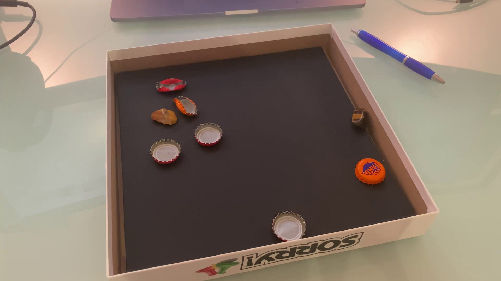
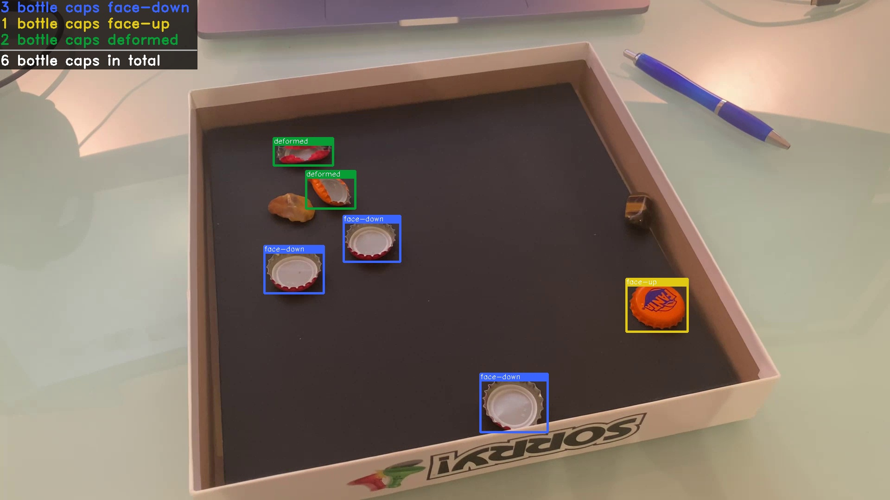
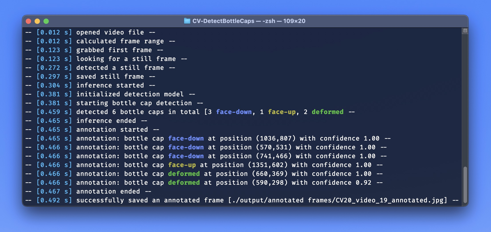

# Cheers - "Detect The Bottle Caps"
**Cheers** is a tiny Python3 script, which 

1. reads some input video file
2. detects and extracts a still frame
3. runs inference on the still frame
4. detects and annotates any matching bottle caps (face-down/face-up/deformed)

I've trained my model using YOLOv4-tiny using ~500 images for training (~200 originally turned into ~500 using image augmentation).
 
## Sample
Here's a quick sample of both a detected and extracted still-frame and the annotated result image.
 
It takes Cheers ***~492ms*** in total to generate both result images; the input was a test-video file by me (~11 seconds, 1080p, 7MB).
 
### Still-Frame detection
The still-frame detection and extraction takes ***~175ms***. 

 
### Inference + Annotation
Inference plus image annotation takes ***~160ms***.


### Verbose console output
Here's the verbose output you'll get, when running Cheers using the `--verbose` flag.

 
## Dependencies
- OpenCV-Python
- Python3

## Install / Run
Simply clone this repo or download + unzip. Then, simply run

`python3 cheers.py --video some_vid.mp4`

or

`python3 cheers.py --image some_img.jpg`

and you'll get an annotated still frame in ./Output/Annotated Frames/ after approx. 0.2s for input images and approx. 0.5-1.0s for input videos. 

**Cheers** can also be used to live-annotate a passed-in video. You can also specify your own confidence- and non-max-suppresion-thresholds; please take a look at the parameters below.

 ## Arguments

```
### input ###
--video			path to video file (to first detect a still frame from and then run inference on)
--image			path to image file (to directly run inference on)

### live-inference and -annotation ###
--live			show live-annotation of the passed in video-file, frame-by-frame

### dnn-variables ###
--conf			confidence threshold [0.0-1.0] whether or not a detected object is a bottle cap
--nms			non-max-suppression threshold [0.0-1.0] used to select the best bounding box per detected object

### misc ###
--verbose		print extensive information per step during runtime
--show-result		immediately show the annotated output frame using cv2.imshow
--show-conf		display the confidence values in the annotated result
--save-stillframe	save the detected still frame (default = false)
--high-precision       	enables comparatively slow, but more precise still-frame-detection and inference

```
